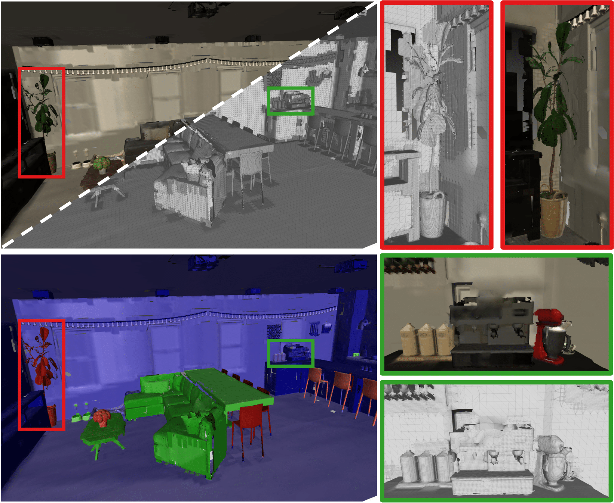

<p align="center">

  <h2 align="center">MAP-Adapt: Motion-Aware Projection for Adaptive Scene Reconstruction</h2>
  <p align="center">
    <a href="https://jianhao-zheng.github.io/"><strong>Jianhao Zheng</strong></a><sup>1</sup>
    ·
    <a href="https://cvg.ethz.ch/team/Dr-Daniel-Bela-Barath"><strong>Dániel Béla Baráth</strong></a><sup>2</sup>
    ·
    <a href="https://people.inf.ethz.ch/marc.pollefeys/"><strong>Marc Pollefeys</strong></a><sup>2, 3</sup>
    ·
    <a href="https://ir0.github.io/"><strong>Iro Armeni</strong></a><sup>1</sup>
</p>

<p align="center"><strong>European Conference on Computer Vision (ECCV) 2024</strong></a>
<p align="center">
    <sup>1</sup>Stanford University · <sup>2</sup>ETH Zurich · <sup>3</sup>Microsoft
</p>
   <h3 align="center">

   [](https://arxiv.org/abs/2406.05849) [](https://map-adapt.github.io/) [](https://opensource.org/licenses/MIT)
  <div align="center"></div>
</p>

## Abstract
<p align="center">
  
</p>

<details>
Creating 3D semantic reconstructions of environments is fundamental to many applications, especially when related to autonomous agent operation (e.g., goal-oriented navigation or object interaction and manipulation). Commonly, 3D semantic reconstruction systems capture the entire scene in the same level of detail. However, certain tasks (e.g., object interaction) require a fine-grained and high-resolution map, particularly if the objects to interact are of small size or intricate geometry. In recent practice, this leads to the entire map being in the same high-quality resolution, which results in increased computational and storage costs. To address this challenge, we propose MAP-ADAPT, a real-time method for quality-adaptive semantic 3D reconstruction using RGBD frames. MAP-ADAPT is the first adaptive semantic 3D mapping algorithm that, unlike prior work, generates directly a single map with regions of different quality based on both the semantic information and the geometric complexity of the scene. Leveraging a semantic SLAM pipeline for pose and semantic estimation, we achieve comparable or superior results to state-of-the-art methods on synthetic and real-world data, while significantly reducing storage and computation requirements.
</details>

## Getting Started

TBA, we are currently cleaning the code.

## Contact
If you have any question, please contact Jianhao Zheng (jianhao@stanford.edu).

## Ackownledgement
Our implementation is heavily based on [Voxblox](https://github.com/ethz-asl/voxblox). We thank the authors for open sourcing their code. If you use the code that is based on their contribution, please cite them as well.

## Citation
If you find our code and paper useful, please cite
```bibtex
@inproceedings{zheng2024map,
  title={Map-adapt: real-time quality-adaptive semantic 3D maps},
  author={Zheng, Jianhao and Barath, Daniel and Pollefeys, Marc and Armeni, Iro},
  booktitle={European Conference on Computer Vision},
  pages={220--237},
  year={2024},
  organization={Springer}
}
```