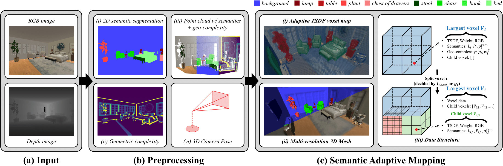

<p align="center">

  <h2 align="center">MAP-ADAPT: Motion-Aware Projection for Adaptive Scene Reconstruction</h2>
  <p align="center">
    <a href="https://jianhao-zheng.github.io/"><strong>Jianhao Zheng</strong></a><sup>1</sup>
    ·
    <a href="https://cvg.ethz.ch/team/Dr-Daniel-Bela-Barath"><strong>Dániel Béla Baráth</strong></a><sup>2</sup>
    ·
    <a href="https://people.inf.ethz.ch/marc.pollefeys/"><strong>Marc Pollefeys</strong></a><sup>2, 3</sup>
    ·
    <a href="https://ir0.github.io/"><strong>Iro Armeni</strong></a><sup>1</sup>
</p>

<p align="center"><strong>European Conference on Computer Vision (ECCV) 2024</strong></a>
<p align="center">
    <sup>1</sup>Stanford University · <sup>2</sup>ETH Zurich · <sup>3</sup>Microsoft
</p>
   <h3 align="center">

   [](https://arxiv.org/abs/2406.05849) [](https://map-adapt.github.io/) [](https://opensource.org/licenses/MIT)
  <div align="center"></div>
</p>

## Abstract
<p align="center">
  
</p>

<details>
Creating 3D semantic reconstructions of environments is fundamental to many applications, especially when related to autonomous agent operation (e.g., goal-oriented navigation or object interaction and manipulation). Commonly, 3D semantic reconstruction systems capture the entire scene in the same level of detail. However, certain tasks (e.g., object interaction) require a fine-grained and high-resolution map, particularly if the objects to interact are of small size or intricate geometry. In recent practice, this leads to the entire map being in the same high-quality resolution, which results in increased computational and storage costs. To address this challenge, we propose MAP-ADAPT, a real-time method for quality-adaptive semantic 3D reconstruction using RGBD frames. MAP-ADAPT is the first adaptive semantic 3D mapping algorithm that, unlike prior work, generates directly a single map with regions of different quality based on both the semantic information and the geometric complexity of the scene. Leveraging a semantic SLAM pipeline for pose and semantic estimation, we achieve comparable or superior results to state-of-the-art methods on synthetic and real-world data, while significantly reducing storage and computation requirements.
</details>

## To-do

  * Release code and script to generate HSSD test dataset.
  * Docker file for easier installation.
  * Evaluation code.

## Installation

**Prerequisites**

1. If not already done so, install [ROS](http://wiki.ros.org/ROS/Installation) (Desktop-Full is recommended).

2. If not already done so, create a catkin workspace with [catkin tools](https://catkin-tools.readthedocs.io/en/latest/):

  ```shell script
  sudo apt-get install python3-catkin-tools
  mkdir -p ~/catkin_ws/src
  cd ~/catkin_ws
  catkin init
  catkin config --extend /opt/ros/noetic
  catkin config --cmake-args -DCMAKE_BUILD_TYPE=Release
  catkin config --merge-devel
  ```

**Install MAP-ADAPT**

1. Install system dependencies:

  ```shell script
  sudo apt-get install python-wstool python-catkin-tools ros-kinetic-cmake-modules protobuf-compiler autoconf
  ```

2. Move to your catkin workspace:

  ```shell script
  cd ~/catkin_ws/src
  ```

3. Download repo using [SSH](https://docs.github.com/en/github/authenticating-to-github/connecting-to-github-with-ssh) or HTTPS:

  ```shell script
  git clone git@github.com:GradientSpaces/MAP-ADAPT.git  # SSH
  ```

  ```shell script
  git clone https://github.com/GradientSpaces/MAP-ADAPT.git  # HTTPS
  ```

4. Download and install package dependencies using ros install:

  * If you created a new workspace.

  ```shell script
  wstool init . ./MAP-ADAPT/dep_ssh.rosinstall    # SSH
  wstool update
  ```

  ```shell script
  wstool init . ./MAP-ADAPT/dep_https.rosinstall  # HTTPS
  wstool update
  ```

  * If you use an existing workspace. Notice that some dependencies require specific branches that will be checked out.

  ```shell script
  wstool merge -t . ./MAP-ADAPT/dep_ssh.rosinstall
  wstool update
  ```

5. Compile and source:

  ```shell script
  catkin build map_adapt_ros
  source ../devel/setup.bash
  ```

## Getting Started

**Demo Data**
We provide two demo dataset from HSSD dataset in [google drive](https://drive.google.com/drive/folders/1sE1Jg6hrnoJpEuST2GQGjHXu0tgHm-ZD?usp=drive_link). Please download and unzip them to your preferred directory. ```map_adapt_ros/src/pc_semantic_geo_pub_node.cpp``` contains the code to load these data. If you want to use MAP-ADAPT with your own dataset with a different data format, please refer to this script and make your own data publisher.

**Run MAP-ADAPT**
In ```map_adapt_ros/launch/run_hssd.launch```, change the data_path, output_path and any other parameters you want to play with. Run the following command to start MAP-ADAPT:
  ```shell script
  roslaunch map_adapt_ros run_hssd.launch adaptive_mapping:=true load_semantic_probability:=true load_geo_complexity:=true\
            voxel_size:=0.08 truncation_distance:=0.2 pc_pub_rate:=20 use_gt_semantic:=false collection_name:=collection1
  ```
Note that this command activate both semantic-adaptive and geometry-complexity-adapt.

## Contact
If you have any question, please contact Jianhao Zheng (jianhao@stanford.edu).

## Ackownledgement
Our implementation is heavily based on [Voxblox](https://github.com/ethz-asl/voxblox). We also refers to the code from [Panoptic_mapping](https://github.com/ethz-asl/panoptic_mapping/tree/3926396d92f6e3255748ced61f5519c9b102570f). We thank the authors for open sourcing their code. If you use the code that is based on their contribution, please cite them as well.

## Citation
If you find our code and paper useful, please cite
```bibtex
@inproceedings{zheng2024map,
  title={Map-adapt: real-time quality-adaptive semantic 3D maps},
  author={Zheng, Jianhao and Barath, Daniel and Pollefeys, Marc and Armeni, Iro},
  booktitle={European Conference on Computer Vision},
  pages={220--237},
  year={2024},
  organization={Springer}
}
```